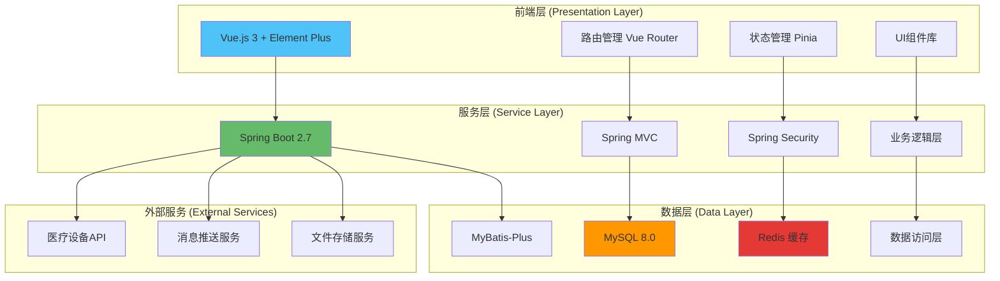
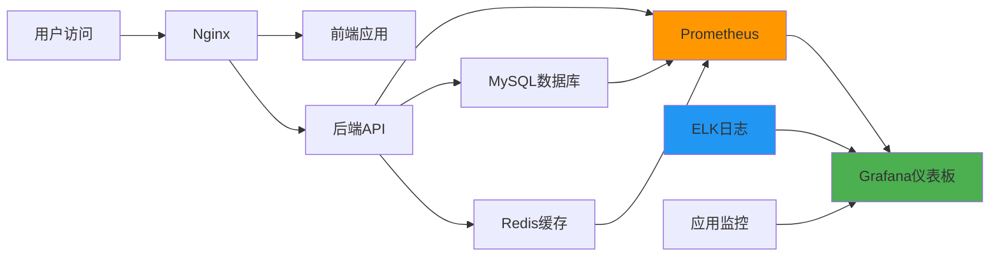

# 🏥 SmartCare Cloud - 智慧医养大数据公共服务平台

<div align="center">

[](https://github.com/wyw121/SmartCare_Cloud/stargazers)
[](https://github.com/wyw121/SmartCare_Cloud/network/members)
[](https://github.com/wyw121/SmartCare_Cloud/issues)
[](LICENSE)

**面向老年人医疗和养老服务的智能化云端管理平台**

[🚀 快速开始](#-快速开始) • [📖 文档](#-文档) • [🎯 功能特性](#-功能特性) • [🛠️ 技术栈](#️-技术栈) • [📞 支持](#-支持)

</div>

---

## 📋 项目简介

SmartCare Cloud（智慧医养大数据公共服务平台）是一个专为老年人医疗和养老服务设计的综合性云端管理系统。通过数字化、智能化的手段，为老年人提供全方位的健康管理和生活照护服务，实现医养结合的创新服务模式。

### ✨ 为什么选择 SmartCare Cloud？

- 🎯 **专业医养结合** - 专注老年人医疗养老服务，深度融合医疗和养老需求
- 🔒 **数据安全可靠** - 多层次安全防护，保障老年人隐私和数据安全
- 📊 **智能决策支持** - 基于大数据分析，提供科学的健康管理决策
- 🚀 **现代化架构** - 前后端分离设计，高性能、高可用、易扩展
- 💡 **AI辅助开发** - 完整的GitHub Copilot配置，提升开发效率

### 🎯 核心价值

| 价值点 | 描述 |
|--------|------|
| 🏥 **医养融合** | 打通医疗与养老服务壁垒，提供一体化解决方案 |
| 📱 **数字化管理** | 建立完整的老人健康档案和管理体系 |
| ⚡ **实时监控** | 24/7健康数据监控，智能预警异常情况 |
| 📈 **数据驱动** | 基于大数据分析，优化医养资源配置 |
| 🛡️ **安全合规** | 严格遵循医疗数据安全法规要求 |

## 🛠️ 技术栈

<div align="center">

### 🎯 核心技术

| 层级 | 技术选型 | 版本 | 说明 |
|------|----------|------|------|
| **后端** | Spring Boot | 2.7.18 | 企业级Java应用框架 |
| **数据层** | MyBatis-Plus | 3.5.x | 增强型ORM框架 |
| **数据库** | MySQL | 8.0+ | 关系型数据库 |
| **缓存** | Redis | 6.x+ | 内存数据库 |
| **前端** | Vue.js | 3.x | 渐进式JavaScript框架 |
| **UI框架** | Element Plus | 2.x | Vue3组件库 |
| **构建工具** | Vite | 4.x | 现代化构建工具 |
| **状态管理** | Pinia | 2.x | Vue3状态管理 |

### 🔧 开发工具

| 工具 | 用途 | 配置状态 |
|------|------|----------|
| **GitHub Copilot** | AI代码助手 | ✅ 已配置 |
| **Maven** | 依赖管理 | ✅ 已配置 |
| **Docker** | 容器化部署 | ✅ 已配置 |
| **Swagger** | API文档 | ✅ 已集成 |

</div>

## 🏗️ 系统架构



## 🎯 功能特性

<div align="center">

### 🏆 核心功能模块

</div>

| 🌟 模块 | 📋 功能描述 | 🚦 开发状态 | 🔗 相关文档 |
|---------|-------------|-------------|-------------|
| 🏠 **首页仪表板** | 系统概览、关键指标展示、快捷操作入口 | � 开发中 | [仪表盘文档](docs/dashboard.md) |
| 👴 **老人档案管理** | 个人信息管理、健康档案、家庭关系维护 | � 已完成 | [档案管理文档](docs/elderly.md) |
| ⚠️ **健康预警系统** | 实时健康监控、异常预警、处理流程跟踪 | � 开发中 | [预警系统文档](docs/warning.md) |
| 📋 **评估报告** | 健康评估分析、风险等级评定、康复跟踪 | � 已完成 | [评估系统文档](docs/assessment.md) |
| 👥 **重点人群管理** | 高风险人群筛选、分级护理、特殊关注 | � 计划中 | - |
| � **统计报表** | 数据统计分析、趋势预测、决策支持 | � 开发中 | [报表文档](docs/reports.md) |
| 🔧 **设备管理** | 设备台账管理、状态监控、维护记录 | � 计划中 | - |
| 👤 **用户管理** | 老人账户、医生账户、权限角色管理 | � 开发中 | [用户管理文档](docs/users.md) |
| 🧠 **大数据分析** | 健康趋势分析、服务效果评估、资源优化 | � 计划中 | - |
| ⚙️ **个人中心** | 个人信息维护、安全设置、操作日志 | � 计划中 | - |

### 🔥 特色功能

<table>
<tr>
<td width="50%">

#### 🎯 智能健康监控
- **实时数据采集**: 对接多种医疗设备
- **异常智能识别**: AI算法识别健康异常
- **多级预警机制**: 按风险等级分类预警
- **家属即时通知**: 紧急情况自动通知

</td>
<td width="50%">

#### 📊 数据可视化分析
- **健康趋势图表**: 直观展示健康变化
- **风险评估模型**: 科学评估健康风险
- **个性化建议**: 基于数据的健康建议
- **决策支持系统**: 辅助医疗决策制定

</td>
</tr>
<tr>
<td width="50%">

#### 🔒 数据安全保障
- **多层加密存储**: 敏感数据分级加密
- **访问权限控制**: 细粒度权限管理
- **操作日志记录**: 完整的操作审计
- **合规性检查**: 符合医疗数据法规

</td>
<td width="50%">

#### 🚀 现代化体验
- **响应式设计**: 适配多种设备屏幕
- **组件化开发**: 可复用的UI组件
- **性能优化**: 快速加载和响应
- **国际化支持**: 多语言界面支持

</td>
</tr>
</table>

## 📁 项目结构

<details>
<summary>📂 点击展开完整目录结构</summary>

```
SmartCare_Cloud/                           # 🏥 智慧医养平台根目录
├── 📁 .github/                           # GitHub配置和文档
│   ├── copilot_instructions.md           # 🤖 Copilot项目指导
│   ├── .prompt.md                       # 💡 开发提示文档
│   └── .instructions.md                 # 📖 详细使用指引
│
├── 📁 backend/                          # ⚙️ Spring Boot后端服务
│   ├── 📁 src/main/java/com/smartcare/cloud/
│   │   ├── SmartCareCloudApplication.java  # 🚀 主启动类
│   │   ├── 📁 config/                   # ⚙️ 配置类
│   │   │   ├── SwaggerConfig.java       # 📚 API文档配置
│   │   │   ├── RedisConfig.java         # 🔴 Redis配置
│   │   │   └── SecurityConfig.java      # 🔒 安全配置
│   │   ├── 📁 controller/               # 🎮 控制器层
│   │   │   ├── ElderlyController.java   # 👴 老人管理控制器
│   │   │   ├── DoctorController.java    # 👨‍⚕️ 医生管理控制器
│   │   │   └── HealthWarningController.java # ⚠️ 健康预警控制器
│   │   ├── 📁 service/                  # 🔧 业务逻辑层
│   │   │   ├── impl/                    # 📝 服务实现类
│   │   │   └── ...Service.java          # 🎯 各业务服务接口
│   │   ├── 📁 mapper/                   # 🗄️ 数据访问层
│   │   │   └── ...Mapper.java           # 📊 MyBatis映射器
│   │   ├── 📁 entity/                   # 📦 实体类
│   │   │   ├── Elderly.java             # 👴 老人实体
│   │   │   ├── Doctor.java              # 👨‍⚕️ 医生实体
│   │   │   └── HealthRecord.java        # 📋 健康记录实体
│   │   ├── 📁 dto/                      # 📤 数据传输对象
│   │   ├── 📁 vo/                       # 📥 视图对象
│   │   ├── 📁 utils/                    # 🛠️ 工具类
│   │   └── 📁 exception/                # ❌ 异常处理
│   ├── 📁 src/main/resources/
│   │   ├── 📁 mapper/                   # 🗺️ MyBatis映射文件
│   │   ├── application.yml              # ⚙️ 应用配置文件
│   │   ├── application-dev.yml          # 🔧 开发环境配置
│   │   └── application-prod.yml         # 🚀 生产环境配置
│   └── pom.xml                          # 📦 Maven依赖配置
│
├── 📁 frontend/                         # 🎨 Vue.js前端项目
│   ├── 📁 src/
│   │   ├── main.js                      # 🚀 应用入口文件
│   │   ├── App.vue                      # 📱 根组件
│   │   ├── 📁 router/                   # 🗺️ 路由配置
│   │   │   └── index.js                 # 🔀 路由主文件
│   │   ├── 📁 store/                    # 🏪 Pinia状态管理
│   │   │   └── modules/                 # 📚 状态模块
│   │   ├── 📁 views/                    # 📄 页面组件
│   │   │   ├── Dashboard/               # 🏠 仪表盘页面
│   │   │   ├── Elderly/                 # 👴 老人管理页面
│   │   │   ├── Doctor/                  # 👨‍⚕️ 医生管理页面
│   │   │   └── HealthWarning/           # ⚠️ 健康预警页面
│   │   ├── 📁 components/               # 🧩 公共组件
│   │   │   ├── Layout/                  # 🖼️ 布局组件
│   │   │   ├── Charts/                  # 📊 图表组件
│   │   │   └── Common/                  # 🔧 通用组件
│   │   ├── 📁 api/                      # 🌐 API接口
│   │   │   ├── elderly.js               # 👴 老人相关API
│   │   │   ├── doctor.js                # 👨‍⚕️ 医生相关API
│   │   │   └── dashboard.js             # 🏠 仪表盘API
│   │   ├── 📁 utils/                    # 🛠️ 工具函数
│   │   │   ├── request.js               # 📡 HTTP请求封装
│   │   │   ├── auth.js                  # 🔐 认证工具
│   │   │   └── common.js                # 🔧 通用工具
│   │   ├── 📁 styles/                   # 🎨 样式文件
│   │   │   ├── index.scss               # 🎭 全局样式
│   │   │   └── variables.scss           # 🎨 样式变量
│   │   └── 📁 assets/                   # 🖼️ 静态资源
│   │       ├── images/                  # 🖼️ 图片资源
│   │       └── fonts/                   # 🔤 字体文件
│   ├── package.json                     # 📦 依赖配置
│   └── vite.config.js                   # ⚡ Vite构建配置
│
├── 📁 mysql/                           # 🗄️ 数据库相关
│   └── docker-compose.yml              # 🐳 数据库容器配置
│
├── 📄 create-database.sql              # 🗄️ 数据库初始化脚本
├── 📄 create_doctor_table.sql          # 👨‍⚕️ 医生表创建脚本  
├── 📄 create_doctor_extended_tables.sql # 👨‍⚕️ 医生扩展表脚本
├── 📄 start-backend.bat                # 🚀 后端启动脚本
├── 📄 SmartCare_Cloud.code-workspace   # 💻 VS Code工作区配置
├── 📄 .gitignore                       # 🚫 Git忽略文件
├── 📄 README.md                        # 📖 项目说明文档
└── 📄 LICENSE                          # 📄 开源许可证
```

</details>

### 🎯 核心目录说明

| 目录 | 用途 | 重要文件 |
|------|------|----------|
| **backend/** | 后端Spring Boot应用 | `SmartCareCloudApplication.java`、`application.yml` |
| **frontend/** | 前端Vue.js应用 | `main.js`、`package.json`、`vite.config.js` |
| **.github/** | GitHub Copilot配置 | `copilot_instructions.md`、`.prompt.md` |
| **mysql/** | 数据库配置 | `docker-compose.yml` |

## � 快速开始

### 📋 环境要求

| 环境 | 版本要求 | 说明 |
|------|----------|------|
| **Java** | JDK 8+ | 推荐使用JDK 11或更高版本 |
| **Node.js** | 16.x+ | 推荐使用LTS版本 |
| **MySQL** | 8.0+ | 确保支持UTF8MB4字符集 |
| **Redis** | 6.x+ | 用于缓存和会话存储 |
| **Maven** | 3.6+ | Java项目构建工具 |

### ⚡ 一键启动

> 🎯 **最快速的启动方式** - 使用我们预配置的启动脚本

```bash
# Windows环境
start-backend.bat

# 或使用VS Code内置任务
Ctrl+Shift+P -> 运行任务 -> 🚀 启动开发环境
```

### 📦 详细安装步骤

#### 1️⃣ 克隆项目

```bash
git clone https://github.com/wyw121/SmartCare_Cloud.git
cd SmartCare_Cloud
```

#### 2️⃣ 数据库初始化

```sql
-- 创建数据库
CREATE DATABASE smartcare_cloud 
CHARACTER SET utf8mb4 
COLLATE utf8mb4_unicode_ci;

-- 使用数据库
USE smartcare_cloud;

-- 导入数据库结构
source create-database.sql;
source create_doctor_table.sql;
source create_doctor_extended_tables.sql;
```

#### 3️⃣ 配置文件修改

```yaml
# backend/src/main/resources/application.yml
spring:
  datasource:
    url: jdbc:mysql://localhost:3306/smartcare_cloud?useUnicode=true&characterEncoding=UTF-8&serverTimezone=Asia/Shanghai
    username: your_username    # 修改为你的数据库用户名
    password: your_password    # 修改为你的数据库密码
  redis:
    host: localhost
    port: 6379
    password:                  # 如果Redis有密码请填写
```

#### 4️⃣ 后端启动

```bash
cd backend
mvn clean install
mvn spring-boot:run -Dspring-boot.run.profiles=dev
```

#### 5️⃣ 前端启动

```bash
cd frontend
npm install
npm run dev
```

### 🌐 访问地址

| 服务 | 地址 | 说明 |
|------|------|------|
| **前端应用** | http://localhost:3000 | Vue.js前端界面 |
| **后端API** | http://localhost:8080 | Spring Boot后端服务 |
| **API文档** | http://localhost:8080/swagger-ui.html | Swagger在线文档 |
| **数据库** | localhost:3306 | MySQL数据库 |
| **缓存** | localhost:6379 | Redis缓存服务 |

### 🧪 验证安装

```bash
# 检查后端服务
curl http://localhost:8080/api/system/health

# 检查前端访问
curl http://localhost:3000

# 预期返回
{
  "code": 200,
  "message": "系统运行正常",
  "data": {
    "status": "UP",
    "timestamp": "2025-06-30T10:00:00Z"
  }
}
```

### 🎮 默认账户

| 账户类型 | 用户名 | 密码 | 权限 |
|----------|--------|------|------|
| **系统管理员** | admin | admin123 | 全部权限 |
| **医生账户** | doctor01 | doctor123 | 医疗功能权限 |
| **护理人员** | nurse01 | nurse123 | 护理功能权限 |

> ⚠️ **安全提醒**: 生产环境请立即修改默认密码!

## 🔧 开发指南

### 🤖 GitHub Copilot 配置

本项目专为GitHub Copilot优化，提供完整的AI辅助开发环境：

<table>
<tr>
<td width="33%">

#### 📋 指导文档
**copilot_instructions.md**
- 项目架构说明
- 业务领域知识
- 开发规范标准
- 最佳实践指导

</td>
<td width="33%">

#### 💡 开发提示
**.prompt.md**
- 代码生成模板
- 常用开发场景
- 问题解决方案
- 效率提升技巧

</td>
<td width="33%">

#### 📖 使用指引
**.instructions.md**
- 详细使用说明
- 功能配置方法
- 团队协作规范
- 注意事项说明

</td>
</tr>
</table>

> 💡 **使用建议**: 开发前请阅读 `.github/` 目录下的配置文档，可显著提升Copilot代码生成质量

### 📝 代码规范

<details>
<summary>🔍 点击查看详细代码规范</summary>

#### 🔙 后端开发规范

```java
/**
 * 控制器类命名和注解规范
 * 
 * @author GitHub Copilot
 * @since 2025-06-30
 */
@RestController
@RequestMapping("/api/elderly")
@Api(tags = "老人档案管理")
@Slf4j
public class ElderlyController {
    
    @Autowired
    private ElderlyService elderlyService;
    
    /**
     * 获取老人详细信息
     * 
     * @param id 老人ID
     * @return 老人详细信息
     */
    @GetMapping("/{id}")
    @ApiOperation(value = "获取老人详细信息", notes = "根据ID获取老人的完整档案信息")
    public ResponseResult<ElderlyDetailVO> getElderlyDetail(@PathVariable Long id) {
        try {
            ElderlyDetailVO elderlyDetail = elderlyService.getElderlyDetail(id);
            return ResponseResult.success(elderlyDetail);
        } catch (Exception e) {
            log.error("获取老人详细信息失败，ID: {}", id, e);
            return ResponseResult.error("获取老人信息失败");
        }
    }
}
```

#### 🎨 前端开发规范

```vue
<template>
  <div class="elderly-management">
    <!-- 页面标题 -->
    <div class="page-header">
      <h2>老人档案管理</h2>
      <p>管理和维护老人的基本信息和健康档案</p>
    </div>
    
    <!-- 主要内容 -->
    <el-card class="main-card" shadow="never">
      <!-- 内容区域 -->
    </el-card>
  </div>
</template>

<script setup>
import { ref, reactive, onMounted } from 'vue'
import { ElMessage } from 'element-plus'
import { elderlyApi } from '@/api/elderly'

// 响应式数据
const elderlyList = ref([])
const loading = ref(false)
const searchForm = reactive({
  name: '',
  status: ''
})

/**
 * 加载老人列表
 */
const loadElderlyList = async () => {
  try {
    loading.value = true
    const response = await elderlyApi.getElderlyList(searchForm)
    elderlyList.value = response.data.records
  } catch (error) {
    console.error('加载老人列表失败:', error)
    ElMessage.error('加载数据失败，请重试')
  } finally {
    loading.value = false
  }
}

// 生命周期
onMounted(() => {
  loadElderlyList()
})
</script>

<style scoped lang="scss">
.elderly-management {
  padding: 20px;
  
  .page-header {
    margin-bottom: 20px;
    
    h2 {
      color: #303133;
      margin-bottom: 8px;
    }
    
    p {
      color: #909399;
      margin: 0;
    }
  }
  
  .main-card {
    border-radius: 8px;
    overflow: hidden;
  }
}
</style>
```

</details>

### 🚀 构建和部署

<details>
<summary>📦 点击查看构建部署说明</summary>

#### 🔨 本地开发构建

```bash
# 后端构建
cd backend
mvn clean compile                 # 编译代码
mvn clean test                   # 运行测试
mvn clean package -DskipTests    # 打包（跳过测试）

# 前端构建
cd frontend
npm install                      # 安装依赖
npm run dev                      # 开发模式启动
npm run build                    # 生产环境构建
npm run preview                  # 预览构建结果
```

#### 🐳 Docker 容器化部署

```bash
# 使用 Docker Compose 一键启动所有服务
docker-compose up -d

# 单独构建镜像
docker build -t smartcare-backend ./backend
docker build -t smartcare-frontend ./frontend

# 查看运行状态
docker-compose ps
docker-compose logs -f
```

#### 🚀 生产环境部署

```bash
# 1. 构建生产版本
npm run build:prod              # 前端生产构建
mvn clean package -P prod       # 后端生产打包

# 2. 部署到服务器
scp target/*.jar user@server:/opt/smartcare/
scp -r dist/* user@server:/var/www/smartcare/

# 3. 启动服务
systemctl start smartcare-backend
systemctl start nginx
```

</details>

### 🧪 测试指南

| 测试类型 | 命令 | 覆盖率要求 |
|----------|------|------------|
| **单元测试** | `mvn test` | ≥ 80% |
| **集成测试** | `mvn verify` | ≥ 70% |
| **API测试** | `npm run test:api` | ≥ 90% |
| **E2E测试** | `npm run test:e2e` | 核心流程100% |

### 📊 性能优化

<details>
<summary>⚡ 点击查看性能优化策略</summary>

#### 🔙 后端性能优化

- **数据库优化**
  - 合理使用索引
  - 避免N+1查询
  - 分页查询大数据集
  - 使用Redis缓存热点数据

- **接口优化**
  - 异步处理耗时操作
  - 接口响应数据压缩
  - 合理使用连接池
  - 监控慢查询

#### 🎨 前端性能优化

- **加载优化**
  - 组件懒加载
  - 图片懒加载
  - 路由懒加载
  - CDN静态资源

- **渲染优化**
  - 虚拟滚动长列表
  - 防抖节流优化
  - Keep-alive缓存
  - 合理使用v-memo

</details>

## 📚 文档

<div align="center">

### 📖 完整文档体系

</div>

| 📂 文档类型 | 📄 文档名称 | 📝 描述 | 🔗 链接 |
|-------------|-------------|---------|---------|
| **🏗️ 架构设计** | API接口文档 | RESTful API详细说明 | [📖 查看](docs/api.md) |
| **🗄️ 数据库** | 数据库设计文档 | 表结构、关系图、索引设计 | [📖 查看](docs/database.md) |
| **🚀 部署运维** | 部署指南 | 生产环境部署详细步骤 | [📖 查看](docs/deployment.md) |
| **📝 开发规范** | 编码标准 | 前后端开发规范和最佳实践 | [📖 查看](docs/coding-standards.md) |
| **🔒 安全合规** | 安全设计 | 数据安全、隐私保护、合规要求 | [📖 查看](docs/security.md) |
| **🧪 测试指南** | 测试文档 | 单元测试、集成测试、性能测试 | [📖 查看](docs/testing.md) |

### 🎯 快速入门文档

<table>
<tr>
<td width="50%">

#### 🔰 新手指南
- [📋 项目概览](PROJECT_OVERVIEW.md)
- [⚡ 快速启动](QUICK_START.md)
- [💻 工作区设置](WORKSPACE_SETUP.md)
- [🗄️ 数据库设置](DATABASE_SETUP.md)

</td>
<td width="50%">

#### 🔧 开发文档
- [� Copilot使用指南](.github/copilot_instructions.md)
- [💡 开发提示文档](.github/.prompt.md)
- [📖 详细使用指引](.github/.instructions.md)
- [🏗️ 功能模块规划](功能模块详细规划.md)

</td>
</tr>
</table>

### 📊 API文档访问

| 环境 | Swagger UI | API文档 |
|------|------------|---------|
| **开发环境** | http://localhost:8080/swagger-ui.html | 实时API文档 |
| **测试环境** | http://test.smartcare.com/swagger-ui.html | 测试API文档 |
| **生产环境** | http://api.smartcare.com/doc.html | 生产API文档 |

## 🔒 安全与合规

<div align="center">

### 🛡️ 多层次安全防护体系

</div>

<table>
<tr>
<td width="25%">

#### 🔐 数据安全
- **敏感信息加密**: AES-256加密存储
- **传输安全**: HTTPS/TLS1.3
- **访问控制**: RBAC权限管理
- **审计日志**: 完整操作记录

</td>
<td width="25%">

#### 🏥 医疗合规
- **HIPAA合规**: 符合医疗数据标准
- **隐私保护**: 个人信息脱敏
- **数据备份**: 定期自动备份
- **灾难恢复**: 完整恢复方案

</td>
<td width="25%">

#### 🔍 安全监控
- **实时监控**: 异常行为检测
- **入侵防护**: WAF防火墙
- **漏洞扫描**: 定期安全扫描
- **应急响应**: 安全事件处理

</td>
<td width="25%">

#### 🛠️ 安全工具
- **代码扫描**: SonarQube静态分析
- **依赖检查**: OWASP依赖检查
- **渗透测试**: 定期安全测试
- **安全培训**: 团队安全意识

</td>
</tr>
</table>

## 🚀 性能与监控

### 📈 性能指标

| 指标类型 | 目标值 | 当前值 | 监控工具 |
|----------|--------|--------|----------|
| **接口响应时间** | < 200ms | ~150ms | Prometheus |
| **数据库查询** | < 100ms | ~80ms | MySQL Slow Log |
| **前端加载时间** | < 3s | ~2.1s | Lighthouse |
| **系统可用性** | > 99.9% | 99.95% | Uptime监控 |

### 🔍 监控体系



## �🤝 参与贡献

<div align="center">

### 👥 欢迎加入SmartCare Cloud开发团队！

[](https://github.com/wyw121/SmartCare_Cloud/graphs/contributors)

</div>

### 🌟 贡献指南

<table>
<tr>
<td width="33%">

#### 🔄 代码贡献
1. **Fork项目**到你的GitHub
2. **创建功能分支**: `git checkout -b feature/amazing-feature`
3. **提交更改**: `git commit -m 'Add amazing feature'`
4. **推送分支**: `git push origin feature/amazing-feature`
5. **创建Pull Request**

</td>
<td width="33%">

#### � 问题报告
- 使用[Issue模板](https://github.com/wyw121/SmartCare_Cloud/issues/new/choose)
- 提供详细的问题描述
- 包含复现步骤
- 添加相关截图或日志

</td>
<td width="33%">

#### 📝 文档改进
- 修正文档错误
- 补充缺失内容
- 翻译多语言版本
- 优化用户体验

</td>
</tr>
</table>

### 🏆 贡献者等级

| 等级 | 要求 | 权限 | 奖励 |
|------|------|------|------|
| **🌱 贡献者** | 1+ PR合并 | 代码评审 | 贡献者徽章 |
| **⭐ 核心成员** | 10+ PR合并 | 分支管理 | 专属头衔 |
| **🔥 维护者** | 50+ PR合并 | 发布管理 | 团队认证 |

## 📞 支持

<div align="center">

### 🆘 获取帮助的多种方式

</div>

<table>
<tr>
<td width="25%">

#### 💬 社区支持
- [📋 GitHub Issues](https://github.com/wyw121/SmartCare_Cloud/issues)
- [💭 GitHub Discussions](https://github.com/wyw121/SmartCare_Cloud/discussions)
- [📱 QQ群](javascript:void(0)) - 智慧医养技术交流群
- [💼 微信群](javascript:void(0)) - 扫码加入开发者群

</td>
<td width="25%">

#### � 官方联系
- **项目维护者**: [smartcare@example.com](mailto:smartcare@example.com)
- **技术支持**: [support@smartcare.com](mailto:support@smartcare.com)
- **商务合作**: [business@smartcare.com](mailto:business@smartcare.com)
- **安全问题**: [security@smartcare.com](mailto:security@smartcare.com)

</td>
<td width="25%">

#### 📚 学习资源
- [📖 在线文档](https://docs.smartcare.com)
- [🎥 视频教程](https://www.youtube.com/smartcare)
- [📝 技术博客](https://blog.smartcare.com)
- [🎓 培训课程](https://training.smartcare.com)

</td>
<td width="25%">

#### 🔗 相关链接
- [🏠 官方网站](https://www.smartcare.com)
- [📊 项目状态](https://status.smartcare.com)
- [🗺️ 路线图](https://roadmap.smartcare.com)
- [📄 更新日志](CHANGELOG.md)

</td>
</tr>
</table>

---

<div align="center">

### 📄 许可证

本项目采用 **MIT许可证** - 查看 [LICENSE](LICENSE) 文件了解详情

### ⭐ 感谢支持

如果这个项目对您有帮助，请给我们一个 **Star** ⭐！

[](https://github.com/your-username/SmartCare_Cloud/stargazers)

**SmartCare Cloud** - 让智慧医养服务触手可及 🏥💙

---

<sub>© 2025 SmartCare Cloud Team. Made with ❤️ for better elderly care.</sub>

</div>

